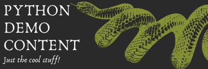

```{r setup, include=FALSE}
library(connectwidgets)
library(dplyr)

knitr::opts_chunk$set(echo = FALSE, message = FALSE, warning = FALSE)

client <- connect(
  # server  = Sys.getenv("CONNECT_SERVER"),
  # api_key = Sys.getenv("CONNECT_API_KEY")
  )

all_content <- client %>%
  content()

sample_content <- all_content %>%
  by_tag("Python") %>%
  by_owner("kelly")
```



## Kelly's Python Content

### card

```{r card}
sample_content %>%
  slice(1) %>%
  rsc_card()
```

### grid

```{r grid}
sample_content %>%
  rsc_grid()
```

